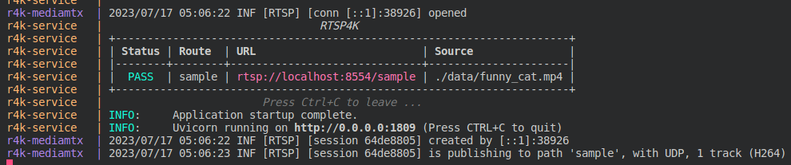
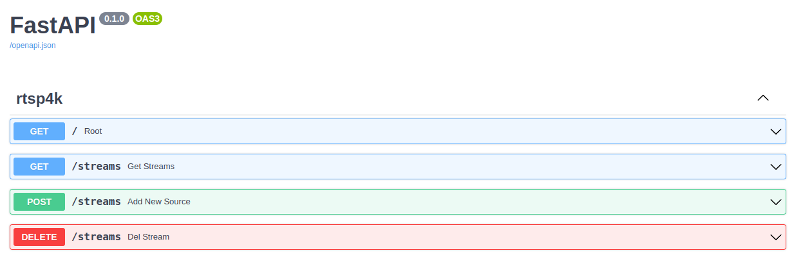

# RTSP for kid ( rtsp4k )
Generate RTSP in simple way.

# Demo
 [](https://youtu.be/yrbf0FJ5Xwc)

# Requirements
* [Docker 20.10 + ](https://docs.docker.com/engine/install/ubuntu/)
* `Docker Compose` >= `v2.15.X`
  * **[ VERIFY ]** Use this command ( `docker compose version` ).
  * **[ INSTALL ]** Install docker compose by following this [document](https://docs.docker.com/compose/install/linux/#install-using-the-repository) if you don't have docker compose.

# Quick Start
```bash
# Clone Repo
git clone https://github.com/p513817/rtsp4k.git && cd rtsp4k

# Launch RTSP4K
docker compose up
 
# Ctrl+C to leave
```


# Add / Delete a Stream
1. Modify Configuration FIle ( [`config.json`](config.json) )
    * Format: the element in brackets is a variable.
      ```json
      {
        "streams": {
          "{route_1}": {
              "input": "{path_to_file}"
          },
          "{route_2}": {
              "input": "{path_to_file}"
          }
        }
      }
      ```
    * Sample: It will generate a rtsp stream ( `rtsp://localhost:8554/sample` )
      ```json
      {
        "streams": {
          "sample": {
              "input": "./data/funny_cat.mp4"
          }
        }
      }
      ```
    
2. Using Web API ( `http://127.0.0.1:1809/docs` )
  


# Reference
* [mediamtx](https://github.com/bluenviron/mediamtx)
* [funny_cat.mp4](https://www.pexels.com/zh-tw/video/855029/)
